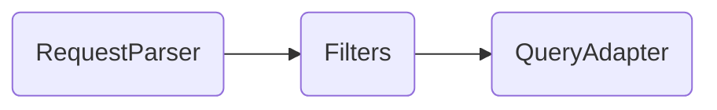

# crud-query-parser

[](https://www.npmjs.com/package/crud-query-parser)

This library parses query parameters from HTTP requests and converts them to database queries, allowing advanced filtering, column selection, pagination and relation joining.

## Features

- Modular architecture, framework-agnostic
- Supports the `@nestjsx/crud` query parameter syntax
- Flexible request manipulation and filtering
- [TypeORM support](./docs/adapters/typeorm.md)
- [MongoDB and Mongoose support](./docs/adapters/mongodb.md)
- [DynamoDB support](./docs/adapters/dynamodb.md)
- [JS arrays support](./docs/adapters/array.md)
- [NestJS support](./docs/frameworks/nestjs.md)
- [NextJS support](./docs/frameworks/nextjs.md)
- [Express support](./docs/frameworks/express.md)
- [Fastify support](./docs/frameworks/fastify.md)
- [h3 support](./docs/frameworks/h3.md)
- [tinyhttp support](./docs/frameworks/tinyhttp.md)
- [http package support](./docs/frameworks/nodejs-http.md)

## Install

```sh
npm install crud-query-parser
```

## Usage



You have to pick a request parser and a query adapter.

```ts
const parser = new CrudRequestParser();
const adapter = new TypeOrmQueryAdapter();
const userRepository = AppDataSource.getRepository(UserEntity); // TypeORM repository

// ...

// The request query object
// This object will likely come from the HTTP request
const requestQuery = { ... };

// Parses the query into a CrudRequest object
let crudRequest = parser.parse(requestQuery);

// Apply filters
// crudRequest = filterRelations(crudRequest, ['posts']);
// crudRequest = ensureLimit(crudRequest, 25, 100);

// Using the query adapter, you can run the query through your ORM by using the CrudRequest
const result = await adapter.getMany(userRepository.createQueryBuilder(), crudRequest); // GetManyResult<UserEntity>

// The result object has properties like data, page, total
console.log(result);
```

## Request parsers

### CRUD Request

The CRUD Request parser is an implementation of the `@nestjsx/crud` [query params format](https://github.com/nestjsx/crud/wiki/Requests#query-params).

```ts
import { CrudRequestParser } from 'crud-query-parser/parsers/crud';

const parser = new CrudRequestParser();

// Then, you have to pass a query string object to it
// const crudRequest = parser.parse(request.query);
```

Read more about the [CRUD Request parser](./docs/parsers/crud.md).

## Database adapters

### TypeORM

This adapter works with TypeORM 0.3.x and 0.2.x

```ts
import { TypeOrmQueryAdapter } from 'crud-query-parser/adapters/typeorm';

const adapter = new TypeOrmQueryAdapter();

// Then, you can pass a query builder to it:
// const result = await adapter.getMany(repository.createQueryBuilder(), crudRequest);
```

Read more about the [TypeORM adapter](./docs/adapters/typeorm.md).

### DynamoDB

This adapter requires [@aws-sdk/client-dynamodb](https://www.npmjs.com/package/@aws-sdk/client-dynamodb) and [@aws-sdk/util-dynamodb](https://www.npmjs.com/package/@aws-sdk/util-dynamodb) 3.x.x

```ts
import { DynamoDBQueryAdapter } from 'crud-query-parser/adapters/dynamodb';
import { DynamoDBClient } from '@aws-sdk/client-dynamodb';

const adapter = new DynamoDBQueryAdapter({
  client: new DynamoDBClient(),
  tableName: 'posts',
  partitionKey: 'id',
});

// Then, you can pass a partial Query/Scan input to it:
// const result = await adapter.getMany({}, crudRequest);
```

Read more about the [DynamoDB adapter](./docs/adapters/dynamodb.md).

### MongoDB

```ts
import { MongoDBQueryAdapter } from 'crud-query-parser/adapters/mongodb';

const adapter = new MongoDBQueryAdapter();

// Then, you can pass a collection to it:
// const result = await adapter.getMany(collection, crudRequest);
```

Read more about the [MongoDB adapter](./docs/adapters/mongodb.md).

### Mongoose

```ts
import { MongooseQueryAdapter } from 'crud-query-parser/adapters/mongodb';

const adapter = new MongooseQueryAdapter();

// Then, you can pass a Query to it:
// const result = await adapter.getMany(Model.find(), crudRequest);
```

Read more about the [Mongoose adapter](./docs/adapters/mongodb.md).

### Array

This adapter can filter, sort and map plain JS arrays.

```ts
import { ArrayQueryAdapter } from 'crud-query-parser/adapters/array';

const adapter = new ArrayQueryAdapter();

// Then, you can pass an array of entities to it:
// const result = await adapter.getMany([], crudRequest);
```

Read more about the [array adapter](./docs/adapters/array.md).

## Frameworks

crud-query-parser is framework-agnostic. You can pass any query parameters object to the parser and it should work out-of-the-box.
However, we have a few helpers or examples for the frameworks listed below:

- [NestJS](./docs/frameworks/nestjs.md)
- [NextJS](./docs/frameworks/nextjs.md)
- [Express](./docs/frameworks/express.md)
- [Fastify](./docs/frameworks/fastify.md)
- [h3](./docs/frameworks/h3.md)
- [tinyhttp](./docs/frameworks/tinyhttp.md)
- [Node.js http](./docs/frameworks/nodejs-http.md)

### NestJS helper

The NestJS helper has OpenAPI support and decorators that automatically parses the request.

```ts
import { Crud, ParseCrudRequest } from 'crud-query-parser/helpers/nestjs';
import { CrudRequestParser } from 'crud-query-parser/parsers/crud';

@Controller('users')
export class UserController {

  @Get()
  @Crud(CrudRequestParser) // <- You specify which parser to use
  public async getMany(@ParseCrudRequest() crudRequest: CrudRequest) { // <- The request query will be automatically parsed
    // ...
  }

}
```

Read more about the [NestJS helper](docs/frameworks/nestjs.md).

### Express helper

The Express helper has a middleware that automatically parses and memoizes the request.

```ts
import { crud } from 'crud-query-parser/helpers/express';
import { CrudRequestParser } from 'crud-query-parser/parsers/crud';

app.get('/users', crud(CrudRequestParser), (req, res) => {
  const crudRequest = req.getCrudRequest();

  // ...
});
```

Read more about the [Express helper](docs/frameworks/express.md).

## Filters

You may need to filter what the user can or cannot query. You can modify the `CrudRequest` object as needed.

There are a few filters provided by the library, which are listed below.

### Enforce a "where" condition

This filter will add the condition on top of all other where conditions

```ts
import { ensureCondition, ensureEqCondition } from 'crud-query-parser/filters';

// ...

crudRequest = ensureCondition(crudRequest, {
  field: ['isActive'],
  operator: CrudRequestWhereOperator.EQ,
  value: true,
});

// Alternatively, a shorthand for equals conditions:
crudRequest = ensureEqCondition(crudRequest, {
  isActive: true,
});
```

### Ensure page limit

This filter will ensure that the requested limit does not go above the maximum.
It also sets the default limit whenever the limit is omitted. 

```ts
import { ensureLimit } from 'crud-query-parser/filters';

// ...

const defaultLimit = 25;
const maxLimit = 100;

crudRequest = ensureLimit(crudRequest, defaultLimit, maxLimit);
```

### Filter property access

This filter removes any property from the request that is not in the allowlist.
It removes unallowed properties from the select fields, where conditions, relations and sorting.

```ts
import { filterProperties } from 'crud-query-parser/filters';

// ...

crudRequest = filterProperties(crudRequest, [
  'id',
  'name',
  'posts',
  'posts.id',
  'posts.name',
]);
```

### Filter relations

This filter removes any relation from the request that is not in the allowlist.
It's the same as the `filterProperties` but only filters relations.

```ts
import { filterRelations } from 'crud-query-parser/filters';

// ...

crudRequest = filterRelations(crudRequest, ['posts']);
```
