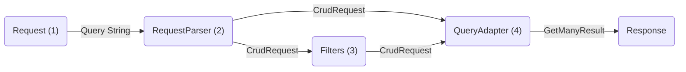

# How crud-query-parser works



1. You receive a request with query parameters
2. These parameters are parsed through a `RequestParser`, which returns a `CrudRequest`.
3. You can modify and filter the `CrudRequest` however you like.
4. The `CrudRequest` is queried through a `QueryAdapter`, which returns the entities

Here's an example in code:

```ts
// Imports and intialization
import { CrudRequestParser } from 'crud-query-parser/parsers/crud';
import { TypeOrmQueryAdapter } from 'crud-query-parser/adapters/typeorm';
import { ensureEqCondition, ensureLimit } from 'crud-query-parser/filters';

const parser = new CrudRequestParser();
const adapter = new TypeOrmQueryAdapter();
```

```ts
// (1) Let's say you receive a request with query parameters, being an object with key and values or a URLSearchParams object.
const queryParams = { fields: "title,description", limit: "5" };

// (2) You can pass the query parameters to a parser in order to obtain a CrudRequest.
let crudRequest: CrudRequest = parser.parse(queryParams);

// (3) You can *optionally* modify and filter the CrudRequest however you like.
crudRequest = ensureEqCondition(crudRequest, { isActive: true }); // Adds an "isActive = true" where condition
crudRequest = ensureLimit(crudRequest, 25, 100); // Ensures the limit does not goes above 100

// (4) Adapts the CrudRequest to your database (we chose TypeORM here as an example)
const result = await adapter.getMany(repository.createQueryBuilder(), crudRequest);

// You can now return the result
```
